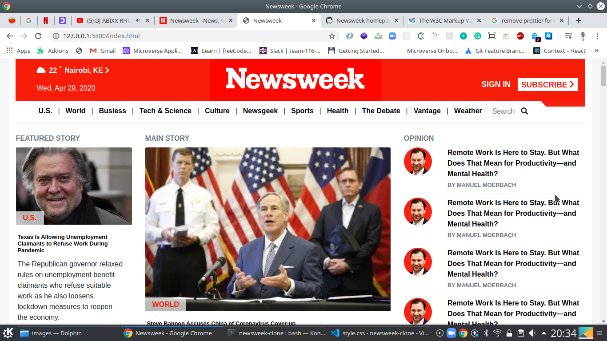
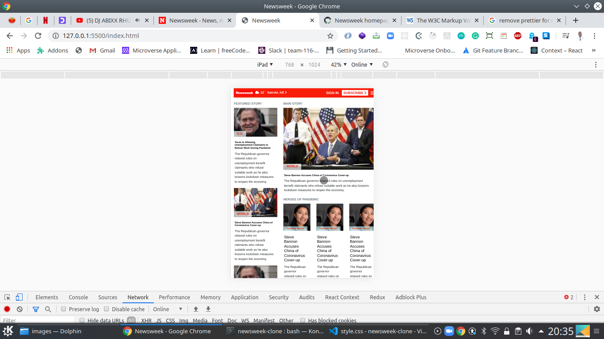
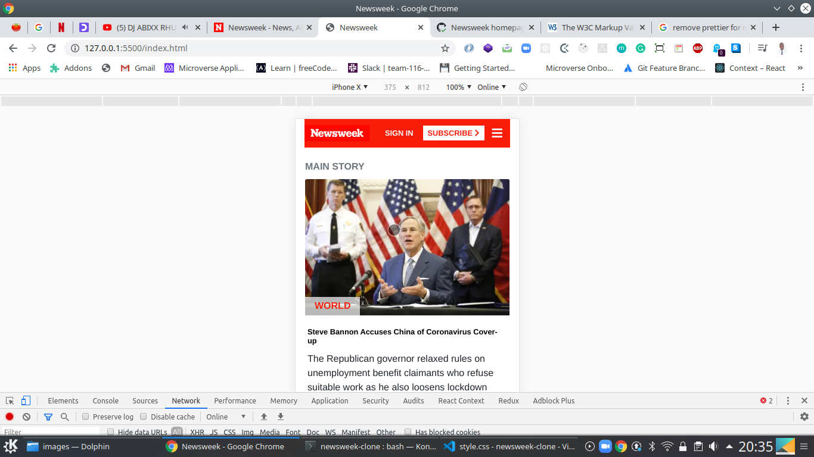

## Newsweek  Clone Project

> this is a clone of the Newsweek homepage ". 
> The goal of the project was to learn deeloping responsive layouts using bootstrap, flex, grid or float
>The layout were achieved using bootstrap grid system
> The project is responsive and can accommondate small, medium and large screens
> dummy images and content have been used repeatedly because the focus on this project is responsive design
> We used semantic HTML to structure the markup 
# large screen 


# medium screen 


# small screen 


## Built With

- HTML5
- CSS3

## Frameworks
- Bootstrap 4

## Author

- Github: [@githubhandle](https://github.com/chirchir12 )
- Twitter: [@twitterhandle](https://twitter.com/shadochir )
- Linkedin: [linkedin](https://www.linkedin.com/in/emmanuel-chirchir/ )
- Email: [email](chirchir7370@gmail.com)


## Getting started

- Clone the repository with:
    ``` hhttps://github.com/chirchir12/newsweek-clone.git  ```
- cd to ```newsweek-clone```

- See the original page [here](https://www.newsweek.com/)

- Check the index.html to edit the structure of the page.

- Check the style.css to edit the style of the page.

## 🤝 Contributing

Contributions, issues and feature requests are welcome!

Feel free to check the [issues page](issues/).

## Show your support

Give a ⭐️ if you like this project!

## Live preview

You can check how the website looks [here](https://rawcdn.githack.com/chirchir12/newsweek-clone/d11e6fe0e87c7f325e75f2c18b6966e9cde887a5/index.html)
## 📝 License

This project is [MIT](lic.url) licensed.
# Newsweek clone Project